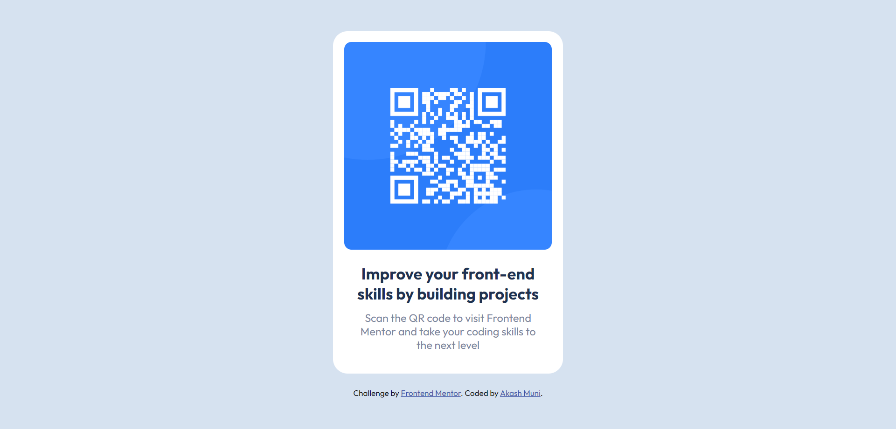

# Frontend Mentor - QR code component solution

This is a solution to the [QR code component challenge on Frontend Mentor](https://www.frontendmentor.io/challenges/qr-code-component-iux_sIO_H). Frontend Mentor challenges help you improve your coding skills by building realistic projects.

## Table of contents

- [Overview](#overview)
  - [Screenshot](#screenshot)
  - [Links](#links)
  - [Built with](#built-with)
- [Author](#author)

**Note: Delete this note and update the table of contents based on what sections you keep.**

## Overview

Buindilg a QR code component and get it looking as close to the design as possible.

### Screenshot

### Links

- Solution URL: [Frontend Mentor](https://github.com/akashmuni/Frontend-Mentor/tree/main/qr-code-component)
- Live Site URL: [QR Code Component](https://qr-code-component-fm-akash-muni.netlify.app)

### Built with

- Semantic HTML5 markup
- CSS custom properties
- Flexbox
- CSS Grid
- Mobile-first workflow

## Author

- Linkedin - [Akash Muni](https://www.linkedin.com/in/akashmuni/)
- Frontend Mentor - [@akashmuni](https://www.frontendmentor.io/profile/akashmuni)
- Twitter - [@akash\_\_codes](https://www.twitter.com/akash__codes)